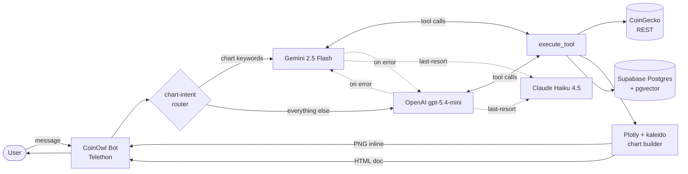

# 🦉 CoinOwl

A Telegram bot for crypto analytics that knows when to talk and when to draw.

Chat the bot in English, Georgian (ქართული), or Russian. An LLM agent decides which tool to call — spot price, market history, top movers, your personal watchlist summary, or a chart — and replies with the result inline. Charts come as PNGs by default; the bot offers an interactive HTML follow-up automatically. Everything lives inside Telegram — no dashboard, no web app, no separate login.

## ⚠️ Not financial advice

CoinOwl provides statistics, historical data, and charts only. It does **not** make price predictions, give buy/sell signals, or offer investment advice. CoinOwl is not a financial advisor and is not licensed to give one.

Cryptocurrency markets are volatile and you can lose money. Any trading or investment decisions are your own — do your own research and, if you're putting meaningful money on the line, consult a licensed financial advisor.

CoinOwl is a tool for analysis. The analysis is on you.

## Mascot

The owl: night vision, patient, picks its moment. Sees the chart you should be looking at instead of the one you're staring at. The 🦉 emoji is the v0 logo — proper artwork lands when there's something worth branding.

## Architecture



The chart-intent router is a regex match on the user's message — words like `chart`, `graph`, `ჩარტი`, `график` route to Gemini first; everything else goes to OpenAI. The routing only picks *which LLM goes first*; the chart PNG/HTML is rendered by Plotly + kaleido regardless. The router exists to conserve Gemini's per-day quota for messages that actually want charts.

Both LLMs fall back to each other silently on error. Claude Haiku 4.5 is a last-resort fallback when both fail (only active if `ANTHROPIC_API_KEY` is set).

Postgres holds: user identity + watchlist + preferred languages + onboarding state, the per-user message-rate window (replaces in-memory quota), and full chat history with Gemini 768d embeddings for RAG-over-past-conversations.

## What it can do

- **Chat** — natural language Q&A in English, Georgian, Russian. "what's BTC at?", "how did ETH do this week?", "ბოლო კვირაში SOL როგორ მოძრაობდა?" all work.
- **Watchlist** — collected during onboarding (capped at 10 coins). Mutated via natural language: "add SOL to my watchlist", "remove DOGE", "replace with BTC ETH AVAX".
- **Market summary** — "show me my watchlist this week" → prices, percent changes, and two composite PNG charts (vertical stack of per-coin sparklines + a normalized %-change comparison overlay). Window inferred from phrasing (24h/7d/30d).
- **Top movers** — "biggest gainers today", "worst losers this week" — top-N across the whole market, any 24h/7d/30d window.
- **Charts** — area chart PNG with y-axis zoomed to the actual price range, plus an inline 200×40 sparkline auto-attached to every stats reply. After a PNG the bot offers an interactive HTML version — say "yes" and it sends the HTML as a Telegram document (pan/zoom/hover).
- **Conversation memory** — your last 6 turns are auto-injected into the system context every reply, so the bot remembers what you were just talking about. For older recall it can call `recall_past_conversations(query)` which embeds your query and runs pgvector cosine search over your full history.
- **Safety** — system prompt + a regex guardrail together prevent the bot from making price predictions or giving buy/sell/hold advice. Disclaimers live in `/start`, `/help`, and `/disclaimer`.

## Stack

| Layer        | Tech                              | Why this pick                                                |
| ------------ | --------------------------------- | ------------------------------------------------------------ |
| Bot          | Telethon                          | Async, full MTProto, leaves the door open for user-account features later |
| Primary LLM (non-chart messages) | OpenAI `gpt-5.4-mini` | 2.5M tokens/day on the free traffic-share tier; good multilingual support |
| Primary LLM (chart messages) | Gemini 2.5 Flash | Tool-calling path we've battle-tested for chart generation; also handles message embeddings (`gemini-embedding-001` @ 768d) |
| Last-resort fallback | Claude Haiku 4.5 | Picks up when both OpenAI and Gemini fail (optional) |
| Charts       | Plotly + kaleido ≥1.0             | PNG inline; HTML doc on follow-up. Gold-on-navy brand palette |
| Data         | CoinGecko REST                    | Free tier; TTL cache (30s spot, 300s history) absorbs typical traffic |
| Storage      | Supabase Postgres + pgvector      | Users, watchlist, quota, full chat history with embeddings — one provider, async driver (`asyncpg`) |
| Logging      | loguru                            | Structured logs in Asia/Tbilisi timezone, file sink at `logs/coinowl.log` |

No web dashboard, no Telegram Login Widget — every interaction lives inside the chat, and the user is already authenticated by the fact that Telegram tells the bot their `user_id`.

## Commands

The primary surface is **natural language** — ask the bot anything about crypto and it routes to the right tool. Slash-commands are scaffolding/quick-paths:

- `/start` — greet and explain what the bot does
- `/help` — list available commands and the current bot version
- `/version` — print the bot version
- `/price <symbol>` — quick spot-price command (e.g. `/price BTC`) — bypasses the LLM
- `/disclaimer` — read the full "not financial advice" notice
- *(any non-command message)* — routed through the LLM agent

First time a user messages the bot they go through onboarding: pick a display name, preferred language(s), and at least one coin for the watchlist. The `onboarded` flag is computed in SQL from those three fields, so if any is missing the bot re-enters onboarding on the next message.

## Setup

```bash
git clone <your-fork-url> coinowl
cd coinowl
python -m venv venv
venv\Scripts\activate          # Windows
# source venv/bin/activate     # macOS/Linux
pip install -r requirements.txt

cp .env.example .env             # Windows: copy .env.example .env
# fill in required vars (see below)
```

### Required environment variables

| Var | How to get |
|-----|-----------|
| `TELEGRAM_API_ID` | <https://my.telegram.org> → API development tools |
| `TELEGRAM_API_HASH` | same |
| `TELEGRAM_BOT_TOKEN` | [@BotFather](https://t.me/BotFather) on Telegram, `/newbot` |
| `GEMINI_API_KEY` | <https://aistudio.google.com/apikey> |
| `DATABASE_URL` | Supabase **Session Pooler** URL (port 5432). Dashboard → Settings → Database → "Session Pooler". Enable the `vector` extension at Database → Extensions before first run. |

### Optional environment variables

| Var | Effect if absent |
|-----|-----------------|
| `OPENAI_API_KEY` | All queries route to Gemini (no intent split). Recommended — without it, Gemini's per-day RPD limit becomes the bottleneck. |
| `OPENAI_MODEL` | Defaults to `gpt-5.4-mini`. Override with `gpt-5.4` for higher quality (smaller daily budget). |
| `ANTHROPIC_API_KEY` | No last-resort fallback. The OpenAI ↔ Gemini chain still works. |
| `COINGECKO_API_KEY` | Free public tier is ~5 req/min; demo key gives ~30 req/min. |

### First run

```bash
python main.py
```

Telethon prompts for phone/bot-token auth and writes `coinowl_bot.session` (gitignored). Subsequent runs reuse the session silently. Send a message to your bot on Telegram and onboarding kicks off.

For stateless cloud hosts (Railway, Fly), use `python scripts/dump_session.py` to print a `StringSession` value, set it via the `TELETHON_STRING_SESSION` env var on the host, and `coinowl_bot.session` is no longer needed.

### Important Supabase note

Supabase's direct connection URL (`db.<ref>.supabase.co:5432`) is IPv6-only without the paid IPv4 add-on and will hang on connect from most networks. **Use the Session Pooler URL**, not the direct one — the username will be compound (`postgres.<project-ref>`).

## Folder structure

```
coinowl/
├── coinowl/
│   ├── core/          # config loading, loguru setup
│   ├── bot/           # Telethon client, commands, quota, onboarding, streaming reply
│   ├── agent/         # LLM dual-provider loop, tool dispatcher, system prompt, guardrail
│   ├── charts/        # Plotly area/bar/sparkline builders, PNG + HTML export
│   ├── data/          # CoinGecko async client, ticker → coingecko-id resolver
│   └── db/            # asyncpg pool, migrations runner, user/message/watchlist repos
├── migrations/        # versioned NNN_*.sql schema files, run once on startup
├── scripts/           # dev helpers: dump_session.py for stateless deploys
├── tests/             # placeholder — no test suite yet (lands in v0.7.5)
├── main.py            # entry point
├── .env.example
├── requirements.txt
└── CLAUDE.md          # session-bootstrap notes for the AI co-developer
```

## Roadmap

Current released version: **v0.7.4** (deployment-ready).

- **v0.7.3 — Alerts & subscriptions** *(next planned feature)* — unified background watcher with two trigger types sharing one push channel:
  - **Price alerts**: "tell me when BTC > $80k or < $75k" → bot stores two alerts → watcher pings on cross.
  - **Scheduled summary pushes**: "send me my watchlist summary every Monday at 9am" → bot stores a cron-like schedule → watcher fires the matching tool (watchlist summary, market summary, top movers, etc.) and pushes the result on cadence.

  Both survive bot restart (state lives in Postgres). New LLM tools: `schedule_push`, `list_scheduled_pushes`, `cancel_scheduled_push`, plus alert creation/cancellation.

- **v0.7.4 — Deployment release** *(shipped)* — `StringSession` support + `scripts/dump_session.py` for stateless cloud hosts (Railway, Fly). 24/7 hosting is a prerequisite for v0.7.3 alerts to actually fire.

- **v0.7.5 — Infra consolidation** — pytest suite for guardrail regex / `wants_chart` / ticker resolver / yes-expansion / quota math; GitHub Actions for import smoke + lint. Plus a chart render cache (skip kaleido on repeats, keyed by `(symbol, days, kind)`) — matters once scheduled summaries fire simultaneously for every subscribed user.

- **v0.8 — News RAG** — CoinDesk RSS → `knowledge_chunks` with Gemini 768d embeddings → grounded "why did X drop?" answers.

- **v0.9 — `/similar` tool** — bootstrap a `coins` table from CoinGecko coin-detail endpoints, embed each coin as a feature vector refreshed on a cron, vector similarity search for "find coins behaving like BTC right now".

- **v1.0 — Exit pre-alpha** — version bump, README polish, drop the "pre-alpha" framing.

## Data attribution

Price and market data are provided by [CoinGecko](https://www.coingecko.com). CoinGecko's [attribution guide](https://brand.coingecko.com/resources/attribution-guide) requires this credit to appear visibly anywhere their data is displayed; bot replies that surface CoinGecko data include the same line.

The free public tier is rate-limited (~5 req/min from residential IPs). Set `COINGECKO_API_KEY` in `.env` to use CoinGecko's free demo plan (~30 req/min) — sign up at <https://www.coingecko.com/en/api/pricing>.

## Status

Pre-alpha. Single developer. All rights reserved.
