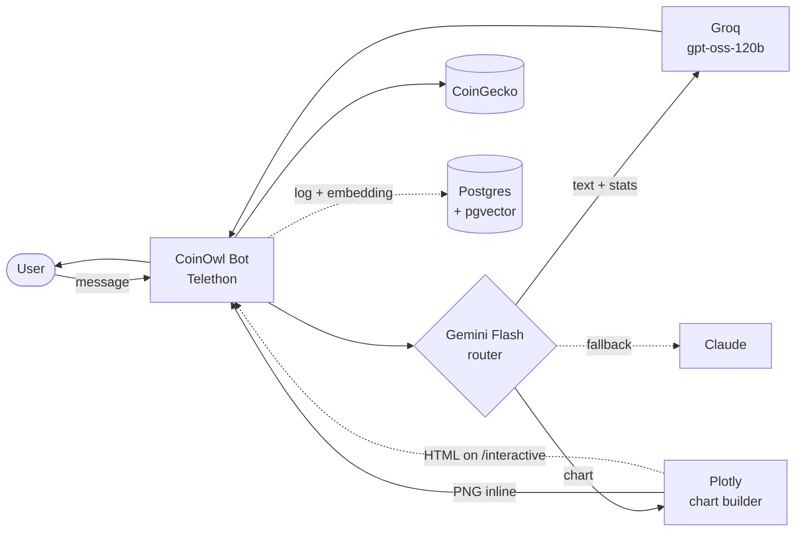

# 🦉 CoinOwl

A Telegram bot for crypto analytics that knows when to talk and when to draw.

Ask CoinOwl a question on Telegram. An LLM router decides whether the answer fits in a chat reply (e.g. "what's BTC right now?" → text with emoji-formatted stats) or whether you really wanted a chart (e.g. "show me ETH vs SOL over the last 30 days" → Plotly chart sent as a PNG inline). Charts are delivered in-chat — no dashboard, no separate web app. If you want to drill into a chart (zoom, hover, toggle traces), `/interactive` re-renders it as a downloadable HTML file.

## ⚠️ Not financial advice

CoinOwl provides statistics, historical data, and charts only. It does **not** make price predictions, give buy/sell signals, or offer investment advice. CoinOwl is not a financial advisor and is not licensed to give one.

Cryptocurrency markets are volatile and you can lose money. Any trading or investment decisions are your own — do your own research and, if you're putting meaningful money on the line, consult a licensed financial advisor.

CoinOwl is a tool for analysis. The analysis is on you.

## Mascot

The owl: night vision, patient, picks its moment. Sees the chart you should be looking at instead of the one you're staring at. The 🦉 emoji is the v0 logo — proper artwork lands when there's something worth branding.

## Architecture



The router is the hinge. Gemini Flash sees the user's message and picks one of two routes: **text-with-stats** (delegated to Groq, formatted with emoji to feel native in chat) or **chart** (Plotly figure exported to PNG and sent inline via Telethon). Claude is the fallback when Gemini errors. Every query is logged with its embedding for the future "find coins behaving like this" feature.

By default chart messages send a PNG — instant, mobile-friendly, renders directly in the chat scroll. Users who want interactivity send `/interactive` as a follow-up; the bot re-renders the most recent chart as a self-contained Plotly HTML file (pannable, zoomable, hoverable). Telegram delivers the HTML as a downloadable document; mobile clients open it inline in a webview, desktop hands it to the system browser.

## Stack

| Layer        | Tech                              | Why this pick                                                |
| ------------ | --------------------------------- | ------------------------------------------------------------ |
| Bot          | Telethon                          | Async, full MTProto, leaves the door open for user-account scraping later |
| Router       | Gemini Flash                      | Cheap + fast tool-calling for a routing decision             |
| Text replies | Groq `gpt-oss-120b`               | Sub-second latency for chat-style answers                    |
| Fallback     | Claude                            | Reliable when the primary router has a bad day               |
| Charts       | Plotly + kaleido                  | PNG inline by default; HTML on `/interactive` for drill-in   |
| Data         | CoinGecko free API                | Good enough for v1; revisit when rate limits bite            |
| Storage      | Postgres + pgvector               | Query log + embeddings in one place, no separate vector DB   |

No web dashboard, no Telegram Login Widget — every interaction lives inside the chat, and the user is already authenticated by the fact that Telegram tells the bot their `user_id`.

## Commands

The bot's primary surface is natural language — ask it anything about crypto in English, Georgian, Russian, or any other language and it will route to the right tool and reply.

- `/start` — greet and explain what the bot does
- `/help` — list available commands and the current bot version
- `/version` — print the bot version
- `/price <symbol>` — quick spot-price command (e.g. `/price BTC`) — bypasses the LLM
- `/disclaimer` — read the full "not financial advice" notice
- `/interactive` *(coming next)* — re-render the most recent chart as an interactive HTML file
- *(any non-command message)* — routed to the LLM agent (Gemini Flash primary, Claude Haiku 4.5 fallback)

## Setup

```bash
git clone <your-fork-url> coinowl
cd coinowl
python -m venv .venv
.venv\Scripts\activate          # Windows
# source .venv/bin/activate     # macOS/Linux
pip install -r requirements.txt

cp .env.example .env             # Windows: copy .env.example .env
# fill in TELEGRAM_API_ID, TELEGRAM_API_HASH, TELEGRAM_BOT_TOKEN
```

Where to get the secrets:

- **`TELEGRAM_API_ID` / `TELEGRAM_API_HASH`** — log into <https://my.telegram.org>, create an application, copy the values. Telethon needs these even when running as a bot (a difference from `python-telegram-bot`).
- **`TELEGRAM_BOT_TOKEN`** — message [@BotFather](https://t.me/BotFather), `/newbot`, follow the prompts. The token he hands back goes here.
- **`GEMINI_API_KEY`** — get from <https://aistudio.google.com/apikey>. This is the primary LLM that powers natural-language chat.
- **`ANTHROPIC_API_KEY`** — get from <https://console.anthropic.com/settings/keys>. Used as the fallback when Gemini errors.
- **`COINGECKO_API_KEY`** (optional) — see [Data attribution](#data-attribution) below.

Then:

```bash
python main.py
```

Send a message to your bot on Telegram. You should get back `🦉 echo: <your text>`.

## Folder structure

```
coinowl/
├── coinowl/
│   ├── core/          # config, logging — cross-cutting utilities
│   ├── bot/           # Telethon client + message handlers + commands
│   ├── agent/         # (placeholder) LLM router + tool calls
│   ├── charts/        # (placeholder) Plotly figure builders + PNG/HTML export
│   ├── data/          # (placeholder) CoinGecko + other sources
│   └── db/            # (placeholder) Postgres + pgvector models
├── tests/
├── main.py            # entry point — runs the bot
├── .env.example
├── .gitignore
├── README.md
└── requirements.txt
```

The empty subpackages are deliberate — they make the architecture visible from commit one and give every future feature an obvious home.

## Roadmap

- **v0 (done)** — repo scaffold, Telethon echo bot, README. The Telegram pipe works end-to-end.
- **v1** — `/start`, `/help`, `/version` commands; CoinGecko client; Gemini Flash router; Groq text replies with emoji-formatted stats; Plotly → PNG charts sent inline; `/interactive` follow-up that re-renders the last chart as HTML; Claude fallback.
- **v2** — Postgres + pgvector. Log every query and its embedding. `/similar <coin>` finds coins whose recent price behavior resembles the query.
- **v3** — quota enforcement (10 questions/day per Telegram user); `/alerts` subscriptions ("ping me when BTC crosses $X").
- **Later** — proper mascot artwork; user-account features (scraping public Telegram channels for sentiment) that justified picking Telethon over `python-telegram-bot`.

## Data attribution

Price and market data are provided by [CoinGecko](https://www.coingecko.com). CoinGecko's [attribution guide](https://brand.coingecko.com/resources/attribution-guide) requires this credit to appear visibly anywhere their data is displayed; bot replies that surface CoinGecko data include the same line.

The free public tier is rate-limited (~5 req/min from residential IPs). Set `COINGECKO_API_KEY` in `.env` to use CoinGecko's free demo plan (~30 req/min) — sign up at <https://www.coingecko.com/en/api/pricing>.

## Status

Pre-alpha. Single developer. All rights reserved.
