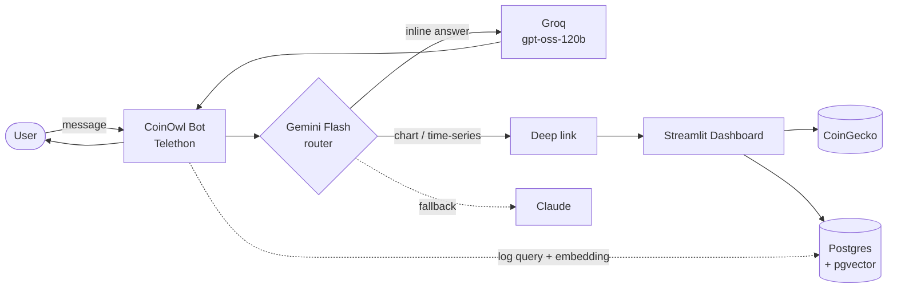

# 🦉 CoinOwl

A Telegram bot for crypto analytics that knows when to talk and when to draw.

Ask CoinOwl a question on Telegram. An LLM router decides whether the answer fits in a chat reply (e.g. "what's BTC right now?") or whether you really wanted a chart (e.g. "show me ETH vs SOL over the last 30 days"). Time-series and comparative questions get a deep link to a Streamlit dashboard pre-loaded with exactly the view you asked for. Simple lookups get answered inline.

## Mascot

The owl: night vision, patient, picks its moment. Sees the chart you should be looking at instead of the one you're staring at. The 🦉 emoji is the v0 logo — proper artwork lands when there's something worth branding.

## Architecture



The router is the hinge. Gemini Flash sees the user's message, decides the route, and either returns a text reply (delegated to Groq for generation) or emits a deep link with the parameters needed to render the right Streamlit view. Claude is the fallback when Gemini errors or refuses. Every query is logged with its embedding for the future "find coins behaving like this" feature.

## Stack

| Layer        | Tech                              | Why this pick                                                |
| ------------ | --------------------------------- | ------------------------------------------------------------ |
| Bot          | Telethon                          | Async, full MTProto, leaves the door open for user-account scraping later |
| Router       | Gemini Flash                      | Cheap + fast tool-calling for a routing decision             |
| Text replies | Groq `gpt-oss-120b`               | Sub-second latency for chat-style answers                    |
| Fallback     | Claude                            | Reliable when the primary router has a bad day               |
| Dashboard    | Streamlit                         | Deep-linkable via `st.query_params`, zero-frontend overhead  |
| Data         | CoinGecko free API                | Good enough for v1; revisit when rate limits bite            |
| Storage      | Postgres + pgvector               | Query log + embeddings in one place, no separate vector DB   |
| Auth (v3)    | Telegram Login Widget             | Reuses the identity the user already has                     |

## Setup

```bash
git clone <your-fork-url> coinowl
cd coinowl
python -m venv .venv
.venv\Scripts\activate          # Windows
# source .venv/bin/activate     # macOS/Linux
pip install -r requirements.txt

cp .env.example .env             # Windows: copy .env.example .env
# fill in TELEGRAM_API_ID, TELEGRAM_API_HASH, TELEGRAM_BOT_TOKEN
```

Where to get the secrets:

- **`TELEGRAM_API_ID` / `TELEGRAM_API_HASH`** — log into <https://my.telegram.org>, create an application, copy the values. Telethon needs these even when running as a bot (a difference from `python-telegram-bot`).
- **`TELEGRAM_BOT_TOKEN`** — message [@BotFather](https://t.me/BotFather), `/newbot`, follow the prompts. The token he hands back goes here.

Then:

```bash
python main.py
```

Send a message to your bot on Telegram. You should get back `🦉 echo: <your text>`.

## Folder structure

```
coinowl/
├── coinowl/
│   ├── core/          # config, logging — cross-cutting utilities
│   ├── bot/           # Telethon client + handlers
│   ├── agent/         # (placeholder) LLM router + tool calls
│   ├── dashboard/     # (placeholder) Streamlit app
│   ├── data/          # (placeholder) CoinGecko + other sources
│   └── db/            # (placeholder) Postgres + pgvector models
├── tests/
├── main.py            # entry point — runs the bot
├── .env.example
├── .gitignore
├── README.md
└── requirements.txt
```

The empty subpackages are deliberate — they make the architecture visible from commit one and give every future feature an obvious home.

## Roadmap

- **v0 (today)** — repo scaffold, Telethon echo bot, README. The Telegram pipe works end-to-end.
- **v1** — CoinGecko client; Gemini Flash router; Groq for text replies; Streamlit dashboard with deep links via `st.query_params`; Claude fallback.
- **v2** — Postgres + pgvector. Log every query and its embedding; "find coins behaving like X" search.
- **v3** — Telegram Login Widget on the dashboard (verify the HMAC-signed user payload server-side using the bot token); 10 questions/day quota per Telegram user.
- **Later** — proper mascot artwork; alert subscriptions ("ping me when BTC crosses $X"); user-account features that justified picking Telethon over `python-telegram-bot`.

## Status

Pre-alpha. Single developer. All rights reserved.
